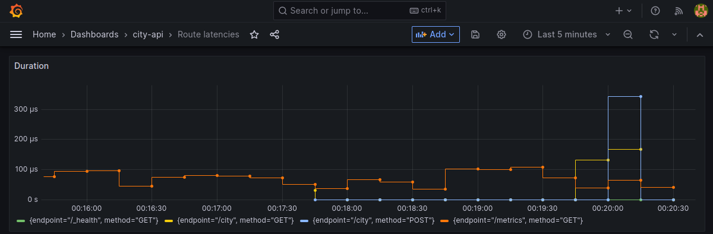

# City-API in Rust

## Docker, Postgres & HTTP API

1. Here is the [compose.yaml](../compose.yaml) with 4 services:

- `api` for the http api
- `db` for the postgres
- `prometheus` to collect the metrics from the api (on the route `/metrics`)
- `grafana` to view the prometheus metrics's scraping of the api

2. For the postgres database, we have decided to provide it an [init sql script](../sql/init.sql).

3. For each route its handler:

- `POST /city`: ["create a city" route handler](../src/routes/create_city.rs)
- `GET /city`: ["fetch cities" route handler](../src/routes/fetch_cities.rs)
- `GET /_health`: [health route handler](../src/routes/health.rs)

If we do not provide these environment variables, the API crashes:

- `CITY_API_DB_URL`
- `CITY_API_DB_USER`
- `CITY_API_DB_PWD`

We can see how to do it, in the [db module](../src/db.rs).

4. For the tests, since there are integration tests, we have decided to put them in a [`tests/`](../tests/) directory.
   There is a `common` module to create a database connection.

You can see all 3 tests:

- `GET /_health` = `test_health_get`, assert on the status code returned
- `GET /city` = `test_fetch_cities`, assert that we return an array of cities (and that we can serialize them)
- `POST /city` = `test_create_city`, assert on the status code returned and on body response (same as the input)

5. The Dockerfile of the API is [here](../Dockerfile)

There is a 2 stage build:

- First, a build stage to build the musl binary (to run it on a `scratch` docker environment)
  - We set the env variable `SQLX_OFFLINE=true` for sqlx to use the file `sqlx-data.json` to check the queries on build time
  - We install the rust toolchain for musl
  - We separate the docker cache of the dependencies and the build (`cargo fetch` & `cargo build` are separated)
- Finally, we copy the binary in another stage and run it

## Github CI

We have 3 github workflows:

- the [linting & test workflow](../.github/workflows/ci.yml)
- the build & push docker image for the http api
  - on each push on master ([master-release.yaml](../.github/workflows/master-release.yml))
  - on each tag created with the format `vX.X.X` ([tag-release.yaml](../.github/workflows/tag-release.yml))

The workflows for master and tag release are a bit redundant, but we didn't find a simple workaround to tag the docker image with the git tag with a workflow condition/dependency (like you can see on the [master-release.yaml](../.github/workflows/master-release.yml), run only if CI workflow has succeeded).

## Helm & Minikube/k3d

We have created an Helm chart in the folder [`helm/`](../helm/).

The chart has a dependency to the `bitnami/postgres` helm chart, like you can see [here](../helm/Chart.yaml) in the `dependencies` field.  
(And there is also its helm tarball provided here: [`helm/charts/postgresql-12.5.9.tgz`](../helm/charts/postgresql-12.5.9.tgz)).

To install it on Minikube or k3d, you can follow the instructions in the [README](../README.md#launch-the-app-on-k3d).

## Prometheus & Grafana

As we said above, we have included a prometheus and grafana services in the [compose file](../compose.yaml).

For their configurations and the grafana dashboard, you can find the files in the `metrics/` directory.

The graph displayed on the Grafana dashboard has this query:

```
sum(rate(city_api_http_requests_duration_seconds_sum{}[30s])) by (endpoint, method)
```

With this, we represent each queries done on the http api by time.
And here is an example in Grafana:



To provide this information, we have used the crate [`actix-web-prom`](https://crates.io/crates/actix-web-prom) as an Actix middleware.

> ℹ️ We have setted 30s for the evaluation interval,
> but Prometheus may need a bit more to show the result.
